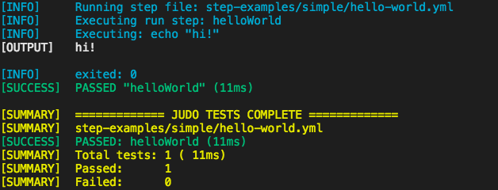
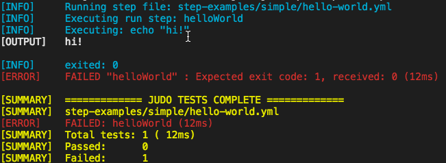

<p align='center'>
  
</p>

<p align='center'>
   <a href='https://circleci.com/gh/intuit/judo'></a>
  <a href='https://www.npmjs.com/package/@intuit/judo'></a>
  <a href='https://www.npmjs.com/package/@intuit/judo'></a>
  <a href='https://codecov.io/gh/Intuit/judo'></a>
  <a href=''></a>
</p>

Judo is an easy-to-use Command Line Interface (CLI) integration testing framework, driven from a simple `yaml` file that instructs the framework what commands to run and how to assert the outcome. Test your CLI tools in an automated fashion using nothing but stdin, stdout and stderr.

## Builds <a name="Builds"></a>

[Continuous Integration][ci] | [Pull Request][pr] | [Release][rl]

## Prerequisites

| Build Dependencies |           |
| ------------------ | --------- |
| [node](https://nodejs.org/en/)           | \>=8.7.0  |
| [python](https://www.python.org/)         | \>=2.7.10 |

## Installation

```
npm i -D @intuit/judo
```

Then in `package.json`

```json
"scripts": {
  "test": "judo <tests-dir>"
}
```

OR if you don't have a `package.json` because you're not in a JavaScript project using npm, then you can install Judo globally and just run it from the command line:

```bash
# install it globally
npm i -g @intuit/judo

# then run it anywhere from the command line
judo <tests-dir>
```

## Usage

The Judo framework interacts with CLIs and provides assertions against the output. The framework assumes the CLIs are installed and available for use. Judo can execute commands, respond to `stdin` when expected `stdout` output occurs, assert the exit code, and assert that the overall output of `stdout` and `stderr` contains or doesn't contain certain strings.

```bash
# point to a "test scenario" file
judo <file>.yml

# or point to a "test suite" directory of "test suite" yaml files
judo <directory>
```

## Options

- `--timeout <n>` : sets a max time in milliseconds that a run step can take before being considered a timeout. ex (`--timeout 1500`)

### Creating Tests with YAML files

Judo organizes tests into "test suites", which comprise of "test scenarios", and each test scenario can contain "steps". A typical test directory may look like this:

```
judo-tests/
  |_update/                    # the update "test suite", containing all tests around updating
  |  |_update-download.yml     # a "test scenario" that asserts the update command downloads something
  |  |_update-to-path.yml      # a "test scenario" that asserts the updated binary is in the path
  |_help/                      # the help "test suite", containing all tests around the --help option
     |_help-output/            # a "test scenario" that asserts the help output is correct
```

Within each "test scenario" `yaml` file, individual "steps" can be defined which can run commands, run prerequisite setup commands, respond to interactions expected by the command line application, and assert the exit code and `stdout`/`stderr` output contains certain things. This is a basic example of a "test suite" with a single step named "helloWorld":

```yml
# test-examples/simple/hello-world.yml
run:
  helloWorld:                  # a "helloWorld" test suite "step"
    command: 'echo "hi!"'
    expectCode: 0
    outputContains:
    - 'hi!'
    outputDoesntContain:
    - 'bye!'
```

Running `judo test-examples/simple/hello-world.yml` will yield this output:

<p align="center">
  
</p>

In this example, a new child process will be spawned which runs `echo "hi"`, then the following assertions will be made:

- the exit code was 0
- the total `stdout` and `stderr` contains `"hi!"`
- the total `stdout` and `stderr` does NOT contain `"bye!"`

If the example `helloWorld` test above had `expectCode: 1` instead, the test would fail and produce this output:

<p align="center">
  
</p>

---

### Complete YAML Example

This is a more complete example, running multiple commands and responding to the `stdin` when appropriate:

```yml
run:
  someCommand:
    prerequisiteCwd: /Users/efrancis/devel/DEVGRU/judo/temp/
    prerequisites:
    - echo "this command will run before the command being tested"
    - echo "this will too"
    - git clone <some repo>
    - cd <some-repo>
    command: git checkout -b "some-feature"
    cwd: /Users/hansolo/test
    when:
    - 'What do you fly?': 'Millenium Falcon'
    - 'Did you shoot first?' : 'y'
    expectCode: 0
    outputContains:
    - 'This string should be in the complete stdout/stderr output'
    - /This is a regex[!]+/g/
    outputDoesntContain:
    - 'This string should NOT be in the complete stdout/stderr output'
  anotherCommand:
    command: 'echo "hi!"'
    expectCode: 0
    outputContains:
    - 'hi!'
    outputDoesntContain:
    - 'bye!'
```

In this example, a new child process will be spawned which runs all of the commands in the `prerequisites` block, inside the `prerequisitesCwd` directory if it's provided. Once that's complete, another child process will be spawned to execute `git checkout -b "some-feature"`, then:

- when the `stdout` or `stderr` contains "`What do you fly?`", the string "`Millenium Falcon \n`" will be sent to the process' `stdin`
- when the `stdout` or `stderr` contains "`Did you shoot first?`", the string "`y\n`" will be sent to the process' `stdin`
- the exit code was 0
- the total `stdout` and `stderr` contains `hi!`
- the total `stdout` and `stderr` output matches the regular expression `/This is a regex[!]+/g/`
- the total `stdout` and `stderr` does NOT contain `bye!`

After that it will spawn another child process and run the `echo "hi!"` command assertion described in the first example.

## How it Works

Judo operates in the following order:

- (if given a directory) searches recursively for all `.yml` "test scenario" files
- for each `.yml` "test scenario", Judo will iterate over each "step" inside that "test scenario"
- for each "step", Judo will spawn a new child process in the directory specified with `prerequisiteCwd` and execute all `prerequisites` at once by combining then with `<command1> && <command2> && ...`
- once prerequisites are complete, Judo will spawn another new child process, this time in the `cwd` specified in the "step", and execute the `command` for that "step". This uses the `node-pty` package to simulate a full terminal as if a user is executing the commands.
- if any `when` assertions are specified for the step, Judo will look for them and respond to them when found. Each will only be responded to once, then marked as complete.
- once the command exits, the output and exit code will be asserted from the `expectCode`, `outputContains`, and `outputDoesntContain` properties of the "step"

## Things to Know

Each `when` response will only happen once, in order of their definition in the `yaml` file. So if you expect the same input multiple times, you need to write multiple responses to it.
